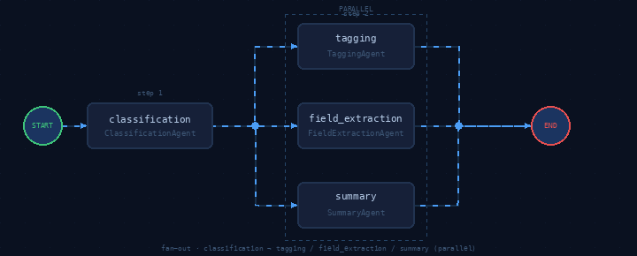
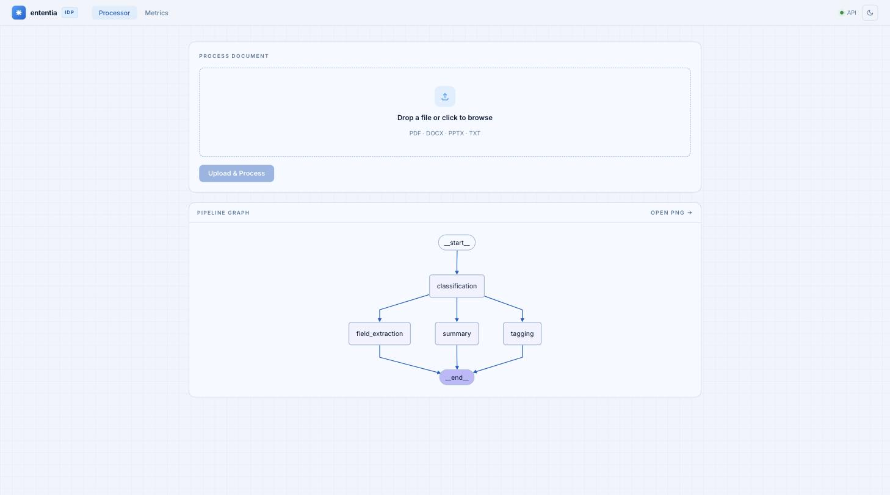
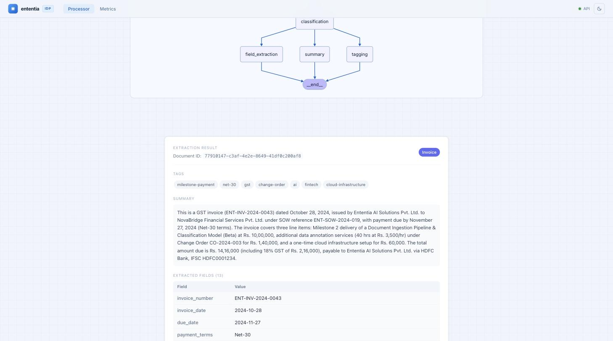
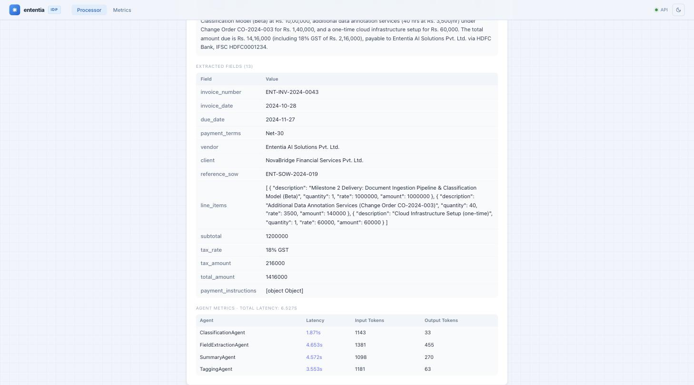
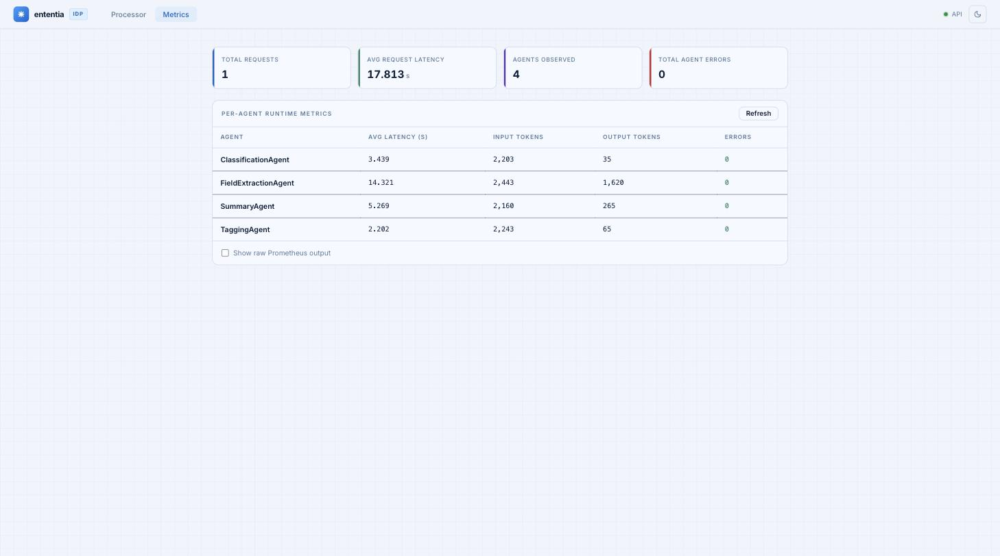

# Ententia IDP

FastAPI-based document intelligence pipeline using multi-format document extraction and multi-agent orchestration.

## What this project does

Ententia IDP is an API service that ingests documents (PDF, DOCX, PPTX, TXT), extracts structured content, and runs an orchestration pipeline to return:

- document classification
- semantic tags
- extracted key fields
- concise summary output

It also exposes health and Prometheus metrics endpoints for operations and observability.

## Tech stack and frameworks

- **Language/runtime**: Python 3.11+
- **API framework**: FastAPI
- **ASGI server**: Uvicorn
- **Configuration**: Pydantic Settings (`.env` + `ENTENTIA_IDP_` prefix)
- **Document extraction/parsing**: `pymupdf`, `python-docx`, `python-pptx`
- **Agent orchestration**: LangGraph-style pipeline
- **LLM provider SDKs**: Anthropic SDK and AWS Bedrock via `boto3`
- **Observability**: Prometheus client metrics, `structlog` logging

## Architecture Decisions

- Single FastAPI service handles document upload, extraction, orchestration, and response assembly.
- Format-specific extractors are used in-process for PDF (`pymupdf`), DOCX (`python-docx`), PPTX (`python-pptx`), and TXT.
- Orchestration is implemented with a LangGraph `StateGraph`: classification runs first, then tagging, field extraction, and summary branch from classification.
- Each agent executes as an isolated stage with structured tool output, token usage tracking, and per-agent cost metadata.
- Failure handling favors partial responses: agent errors are captured and returned with diagnostics instead of failing the entire request immediately.
- Request-level and agent-level metrics are exported on `/metrics` for observability.

See `docs/ARCHITECTURE.md` for full architecture details.

## Pipeline



Classification runs first, then tagging, field extraction, and summary execute in parallel before the result is assembled.

## UI Screenshots

### Document Processor

Upload a PDF, DOCX, PPTX, or TXT file and run the full multi-agent pipeline in one click.
The pipeline graph shows the LangGraph flow — classification runs first, then field extraction,
tagging, and summary execute in parallel.



---

### Extraction Output

After processing, the result panel shows the document classification, semantic tags, LLM-generated
summary, and all extracted fields. Fields are dynamic — the LLM decides what to extract based on
document type rather than applying a fixed schema.





---

### Metrics Dashboard

Per-agent runtime metrics including average latency, input/output token counts, and error rates.
Backed by Prometheus and refreshable without reloading the page.



---

## Setup

1. Create and activate a virtual environment:

```bash
python3 -m venv .venv
source .venv/bin/activate
```

2. Install dependencies:

```bash
pip install -r requirements.txt
```

3. Configure environment variables for local run:

```bash
cp .env.example .env
```

Required local variables in `.env`:

- `ENTENTIA_IDP_AWS_REGION`
- `ENTENTIA_IDP_AWS_PROFILE_NAME`
- `ENTENTIA_IDP_BEDROCK_MODEL_ID`

Optional local variables (with defaults or environment-specific use):

- `PORT` (default: `8000`)
- `ENTENTIA_IDP_BEDROCK_MAX_TOKENS` (default: `4096`)
- `ENTENTIA_IDP_CACHE_DIR` (default: `${HOME}/.cache/ententia-idp`)
- `ENTENTIA_IDP_REQUEST_TIMEOUT_SECONDS` (default: `120`)
- `ENTENTIA_IDP_ENABLE_PROMETHEUS` (default: `true`)
- `ENTENTIA_IDP_PROMETHEUS_METRICS_PATH` (default: `/metrics`)
- `GRAFANA_CLOUD_PROMETHEUS_URL` (needed for Grafana Cloud remote metrics push setup)
- `GRAFANA_CLOUD_PROMETHEUS_USERNAME` (needed for Grafana Cloud remote metrics push setup)
- `GRAFANA_CLOUD_PROMETHEUS_PASSWORD` (needed for Grafana Cloud remote metrics push setup)

## Run with Uvicorn

Use Uvicorn to run the FastAPI service:

```bash
uvicorn ententia_idp.main:app --app-dir src --host 0.0.0.0 --port 8000
```

Or start directly with Python:

```bash
python -m ententia_idp.main
```

## Endpoints

- `GET /health` - health check
- `POST /process_document` - upload a PDF, DOCX, or text file
- `GET /metrics` - Prometheus metrics
- `GET /pipeline_graph` - LangGraph pipeline Mermaid definition
- `GET /pipeline_graph.png` - LangGraph pipeline graph PNG (if rendering dependencies are available)
- `GET /ui` - simple React UI for document processing and metrics

## Run with Docker Compose + Grafana Alloy

1. Copy environment template and update values:

```bash
cp .env.example .env
```

2. In `.env`, set:
   - `GRAFANA_CLOUD_PROMETHEUS_URL`
   - `GRAFANA_CLOUD_PROMETHEUS_USERNAME`
   - `GRAFANA_CLOUD_PROMETHEUS_PASSWORD`

3. Start the stack:

```bash
docker compose up -d --build
```

4. Verify services:
   - App health: `http://localhost:8000/health`
   - App metrics: `http://localhost:8000/metrics`
   - Alloy UI: `http://localhost:12345`

## Notes

- `requirements.txt` already includes `uvicorn[standard]`.
- The app uses `ENTENTIA_IDP_CACHE_DIR` if set, otherwise defaults to `~/.cache/ententia-idp`.
